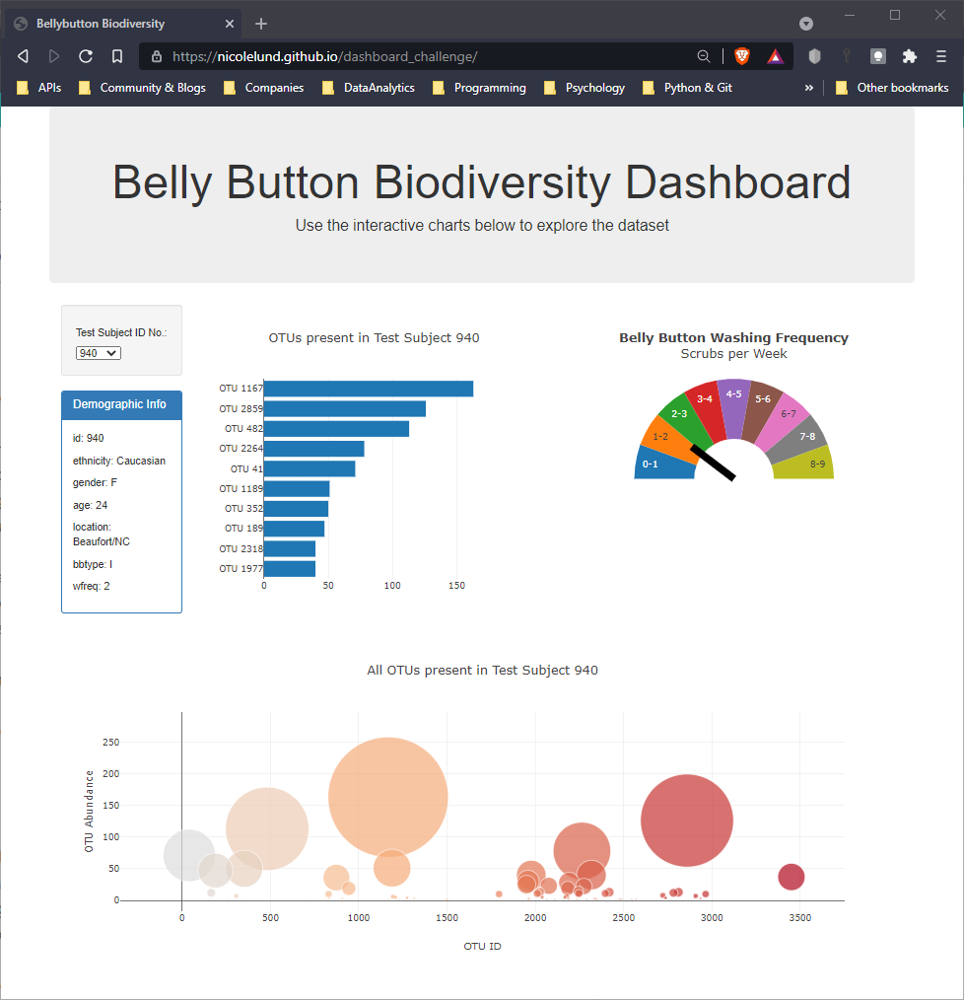
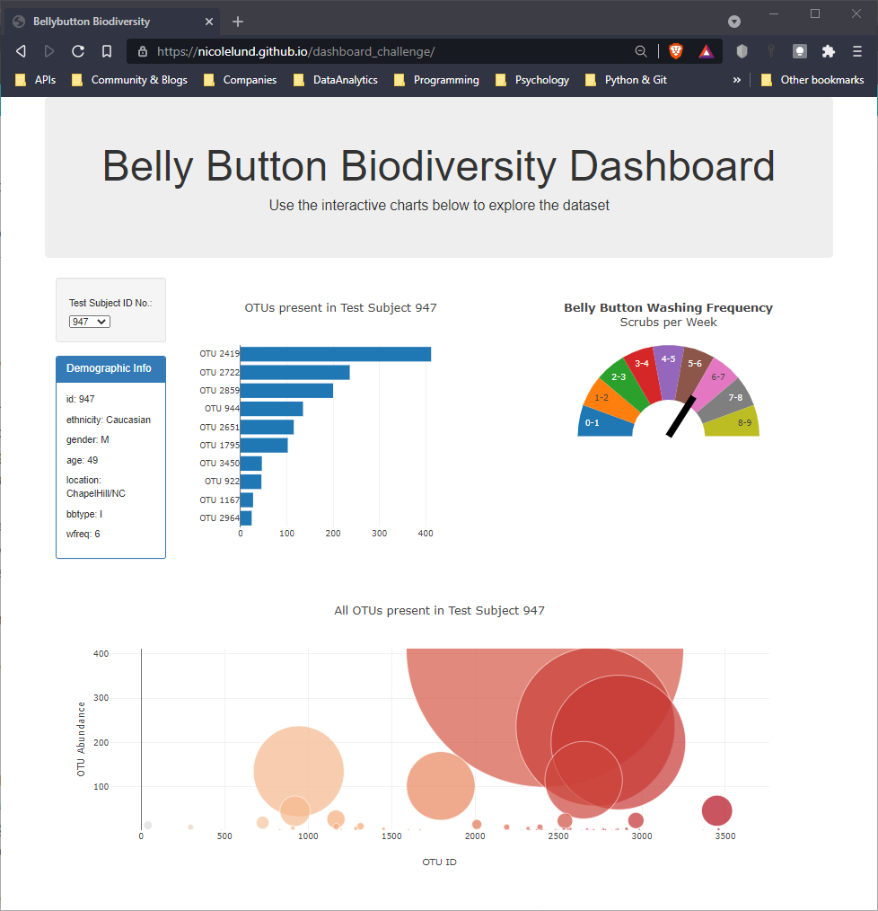

# dashboard_challenge

UofA Data Analytics Bootcamp Homework Assignment 15-Interactive-Visualizations-and-Dashboards

### Assignment Description

Build a responsive webpage that displays data according to the users drop down box selection.

### Webpage link
https://nicolelund.github.io/dashboard_challenge/

### Tools Utilized
| Webpage | User Interface |
|----------|----------|
| HTML | D3.js |
| Bootstrap | JSON |

### Source Data and Starter Code
* Provided by UofA Data Analytics Bootcamp

### Project Content Descriptions
* assignment_instructions: Instructions, data and starter code for completing the assignment.
* data: JSON formatted data used by the webpage.
* images: Webpage screenshots.
* scripts: Javascript code for building the interactive webpage.
* index.html: HTML code for the interactive webpage.

## Completed webpage
Inital Webpage load

Webpage after user selection

